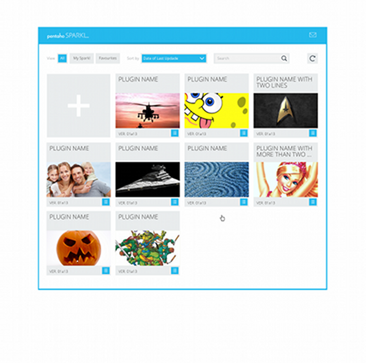
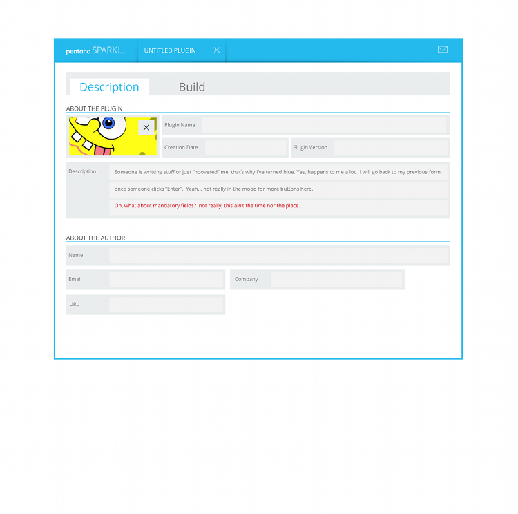
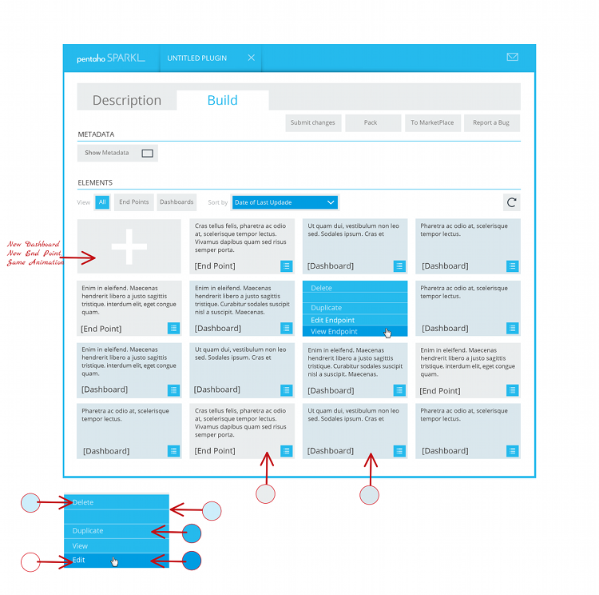

<!-- 

Here is the template we should use. Actual implementation follows

Application
=============

In this section you should have the overall description of the application.

Dashboards
==========

This section list and describes the application main visual "landing points":
the application dashboards.

## Dashboard 1
-------------

### Goal

This subsection has a description of the goal of dashboard 1

### Mockup

A screenshot of the mockup in mind

### Actions 

This subsection has a more detailed description of dashboard, including a list
of actions allowed on this dashboard, along with a mockup to give a visual
insight.

### Navigation

Here should be the information regarding the dashboard navigation restrictions
(e.g. if there should be a link to a contextual help page or where/when the user
should navigate to dashboard 2).

### Endpoints

In this subsection you will find the list of kettle end points associated to
actions on the dashboard.

Endpoints
---------

This section describes the End Points (Kettle) in the application. These
endpoints were mentioned in the previous section, in connection to the
application dashboards. Here, we have a detailed description of each one of
them, including their logic, input parameters and output types.

* Endpoint 1
	* Description:	
	* Parameters: 
	* Output: 
* Endpoint 2
	* Description: 
	* Parameters: 
	* Output:  

-->

CPK - Sparkl
============

The Community Plugin Kick-starter (CPK) is a tool that allows you to create and
manage Business Intelligence applications based on the Pentaho-Ctools framework.
These applications (or Plugins) are basically a set of dashboards and Kettle
Endpoints organised in a way to accomplish the application's goal. These
Dashboards and Endpoints (implemented in Kettle) are the plugins building blocks
and are referred to as the plugin "Elements".  Sparkl, the CPK User Interface, is itself a CPK application and thus it follows the same planning roadmap as any other CPK application. The present document consists on the planning of Sparkl. At the end it should be clear to the reader what are the application's Dashboards and Kettle Endpoints, their goals, logic, actions and how all these are wrapped up to form a consistent plugin.

Sparkl offers a visual interface to CPK. Its goal is to allow managing CPK plugins and creating new ones.

Dashboards
==========

Sparkl is made of two dashboards: 

* The landing page, that we call "Main", which lists the existing plugins and offers several global and plugin-specific options;
* the "Plugin Info" dashboard, which shows the plugin information, including the plugin metadata and its elements and allows several editing options.

Main Dashboard 
--------------

### Goal

The Main dashboard must give user access to the existing CPK plugins. Mainly
it consists on a list of existing plugins, a set of global options and a set of
plugin-specific options.

### Original hand-made Mock-up

### UX Mock-up 

### Actions

The dashboard contains a set of four *global options*:

* _New Plugin_: allows to create a new plugin. The user must insert a nre plugin Id. A verification if the plugin Id just inserted is free for use and in case it is already in use, a cancelation message should be prompt. In case the plugin Id is free, opens the "Plugin Info" dashboard (see below) with the plugin metadata all blank, ready to be filled;
* _Import Plugin_: allows to import a remotely hosted plugin to the local CPK
  plugins folder. Opens a form to be filled with the plugin url/localisation. **This option is not implemented yet and is left for a second stage.**
* _Refresh List_: updates the list of plugins;
* _Request Pentaho Services_: sends email requesting Hitachi Vantara services/support. **This option is now present in all Sparkl dashboards on the dashboards container's header.**

The dashboard also contains a *table* listing the existing plugins, each row with the corresponding plugin's Id, name, description and a set of *plugin options*:

* _View_: Opens Sparkl sencond dashboard with the plugin info and editing options; 
* _Delete_: Deletes the corresponding plugin, prompting a confirmation popup before proceeding with that action.

### Navigation

The _Main_ dashboard gives access to:

* the _plugin Info_ dashboard, whenever the user chooses the "View" option,
  for a specific item on the plugins table or the "New Plugin" option;
* a _form_ to be filled with the url/localisation of the plugin to be
  imported, whenever the user chooses the "Import Plugin" option. *This form is not implemented yet and is postponed to a second stage of the Sparkl plugin.*
* the _email_ default application, whenever the user chooses the "Request
  Pentaho Services" option;

### Endpoints

The set of Endpoints for the _Main_ dashboard are:

* listPlugins;
* deletePlugin
* importPlugin **(postponed)**.	

Plugin Info Dashboard
---------------------

### Goal

The Plugin Info dashboard must give full information about the selected plugin
and allow the user to edit it by changing the plugin's metadata or adding/deleting/changing plugin elements.

### Original hand-made Mock-up

### UX Mock-up 

#### Description View

#### Build View

### Actions

The dashboard contains a set of *global options*:

* _Submit changes made on metadata_: either saves changes made to the plugin metadata or create the new plugin;
* _Submit changes made on elements_: saves changes made on elements;
* _Submit changes to author (email)_: sends an email to the plugin author with
  the new version attached;
* _Update CPK libraries_: updates the CPK libraries in the plugin;
* _Edit Metadata_: gives the user access to the plugin metadata (see below) by editing its fields;
* _Pack (zip)_: packs the plugin in a zip file;
* _Send by Email_: sends email to a specific destination with the new version
  attached;
* _Market Place push_: submit the new version to Market Place;
* _Feedback (email)_: sends email to pentaho/ctools/plugin-author with
  feedback;
* _Report a Bug (email)_: sends email to pentaho/ctools/plugin-author
  reporting a bug;
* _New Element_: allows to add a new element. Opens two sets of adding options, one for new dashboards and other for new endpoints. Each set has the following:
	* _Templates_ a list of templates to choose from;
	* _Name_: a form to insert the name of the new element;
	* _Admin_: a checkbox to restrict the new element's accesibility to users of type Admin;
	* _New_: a clickable button to confirm the creation of the new element; 
* _Back to CPK plugins list_: returns to the _Main_ dashboard.

The dashboard contains a *list* of the plugin metadata, with the following info: 

* _Plugin Name_;
* _Description_;
* _Author_:
	* Name,
	* Email; 
	* Company,
	* Url;
* _Creation date_;
* _Plugin Version_;

 

The dashboard also contains a *table* listing the plugin elements (with the plugin's name, type and admin-users restriction) and a set of
*elements options* accessible to each item in the table:

* _Delete_: deletes the specific table item; 
* _Duplicate_: duplicates the specific table item; 
* _Edit (dashboards only)_: opens the dashboard on the *Community Dashboard
  Editor* (CDE);
* _View (dashboards only)_: opens the dashboard;
* _View Data Sources (dashboards only)_: opens the dashboard's cda file;
* _Run (kettle only)_: Runs the endpoint

### Navigation

The _Plugin Info_ dashboard gives access to:

* the _email_ default application, whenever the user chooses the "Submit
  changes to author" option, the "Email" option, the "Feedback" option or the
  "Report a Bug" option;
* a _Save As_ form for the user to set the location on which to save, whenever
  the user chooses the "Pack (zip)" option;
* the _Community Dashboard Editor (CDE)_, whenever the user chooses the
  "Edit" option, for a specific dashboard on the plugin elements table;
* opens a new browser tab with the selected dashboard, whenever the user chooses the "View" option, for a specific dashboard on the plugin elements table;
* the _Community Data Access (CDA)_, whenever the user chooses the "View Data Sources" option, for a specific dashboard on the plugin elements table;
* the endpoins viewer, whenever the user chooses the "View Endpoint" option, for a specific endpoint on the plugin elements table;
* the _Main_ dashboard, whenever the user closes the plugin info view by clicking a close button on the header of the dashboard container;
* to a popup with options for the creation of new elements, whenever the user chooses the "New Element" option, from the global options set.

### Endpoints

The set of Endpoints for the _Plugin Info_ dashboard are:

* createPlugin;
* submitChangesToAuthor;
* getPluginMetadata;
* updateMetadata;
* updateLib;
* updatePlugin;
* packPlugin;
* sendByEmail;
* pushToMarketPlace;
* deleteElement;
* duplicateElement;
* listElements;
* listTemplates;
* createElement.

Endpoints
=========

These endpoints were mentioned in the previous section. Here, we have a
"detailed" description of each one of them:

* listPlugins (done)
	* Description: list CPK plugins locally available
	* Parameters: (none)
	* Output: table with the metadata distributed over the columns
* createPlugin(done)
	* Description: create new plugin with metadata inserted by users on a blank "plugin info" dashboard
	* Parameters: plugin Id
	* Output: (operation status)
* importPlugin
	* Description: 
	* Parameters: 
	* Output:
* deletePlugin (done)
	* Description: delete selected plugin
	* Parameters: plugin Id
	* Output: (operation status) 
* getPluginMetadata (done)
	* Description: get plugin metadata to be shown in the "Plugin Info" dashboard
	* Parameters: plugin Id
	* Output: table with plugin's metadata
* submitChangesToAuthor
	* Description: pack plugin and open email default application with zip file already attached and author/pentaho/ctools email address already inserted
	* Parameters: plugin Id, 
	* Output: (operation status)
* pushToMarketPlace
	* Description: pack plugin and push to Market Place
	* Parameters: plugin Id
	* Output: (operation status)	 	
* updateMetadata (done)
	* Description: save metadata values inserted by user and merge with existing values (if any)
	* Parameters: plugin Id, table with changed metadata
	* Output: (operation status)
* updateLib (done)
	* Description: override the plugin's CPK libs with their current version
	* Parameters: plugin Id
	* Output: (operation status)
* updatePlugin (done)
	* Description: do updateLib and updateMetadata together ??
	* Parameters: plugin Id
	* Output: (operation status)
* listElements (done)
	* Description: list the plugin elements (dashboards and endpoints) with the following info: _element name_, _element description_, _element type_, _element Admin property_, _element location_, _number of queries in element (dashboards only)_, _element Id_
	* Parameters: plugin Id
	* Output: table listing the plugin elements and corresponding info
* packPlugin (done)
	* Description: create a zip file with the plugin current version
	* Parameters: plugin Id and url/path to save the pack
	* Output: (operation status)
* sendByEmail
	* Description: pack plugin and open email default application with zip file already attached
	* Parameters: plugin Id
	* Output: (operation status)
* deleteElement (WIP)
	* Description: delete element from plugin
	* Parameters: plugin Id, element Id
	* Output: (operation status)
* duplicateElement (WIP)
	* Description:
	* Parameters:
	* Output:
* createElement (done)
	* Description: duplicate element template (can be blank template) and save it on the target plugin, with the new name and user type restrictions inserted  
	* Parameters: template Id, target plugin Id, name, Admin
	* Output: (operation status)
* listTemplates (not done)
 	* Description: lists elements templates (to feed selector)
	* Parameters: (none) 
	* Output: table with all available elements templates
